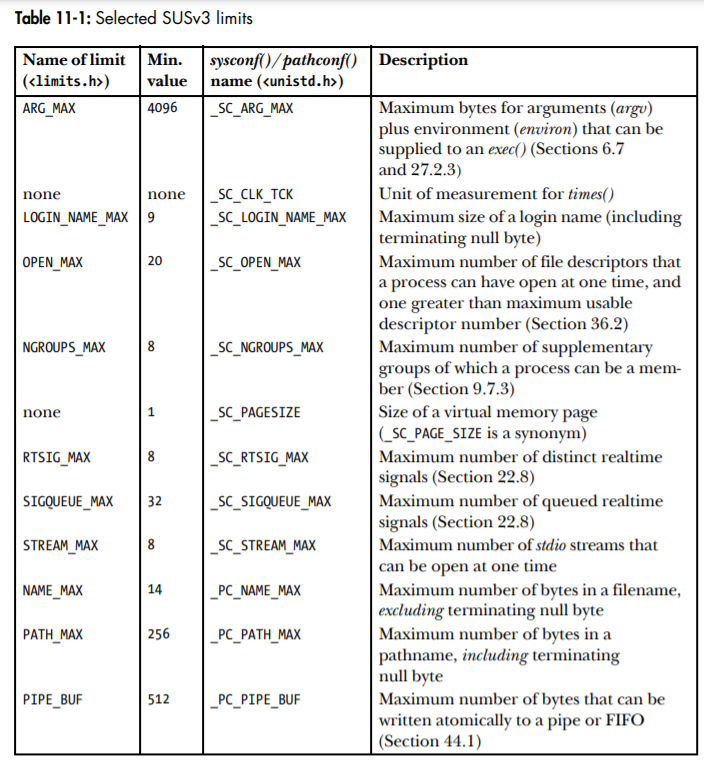

# **CHEETSHEET MEMORY ALLOCATION, USERS & GROUPS, TIME, SYSTEM LIMITS & OPTIONS**


## **MEMORY ALLOCATION**
The current limit of heap is referred to as the **`program break`**.

```
#include <unistd.h>         /* for brk|sbrk */
#include <stdlib.h>         /* for malloc|calloc|realloc|free|posix_memalign */
#include <malloc.h>         /* for memalign */

```

* int **`brk`** (void *end_data_segment);  
~ **Sets** the *program break* to the location specified by *end_data_segment*. Since virtual memory is allocated in units of pages, *end_data_segment* is effectively rounded up to the next page boundary.   
~ returns 0 on success, or -1 on error.  

* void \***`sbrk`** (intptr_t increment);  
~ **Adjusts** the *program break* by adding an *increment* to it.  
~ On success, returns the previous address of *program break*. On error, `(void *) -1` is returned.
```
sbrk(0);        // returns the current setting of program break without changing it.
```

* void \***`malloc`** (size_t size);  
~ Allocates *size* bytes from the heap and returns a (void *) pointer to the newly allocated block of memory on success, or NULL on errror. 

* void \***`calloc`** (size_t numitems, size_t size);  
~ Allocates memory for an array of identical items. The *numitems* identify how many items of *size* to allocate. Unlike malloc, it clears of the allocated memory to 0 bytes.
~ returns pointer to allocated memory on success, or NULL on error.

* void \***`realloc`** (void *ptr, size_t size);  
~ Used to *resize* a block of memory (previously allocated by one of the member functions of malloc family). The ptr argument is a pointer to the block of memory that is to be resized. The size argument specifies the desired new size of the block.  
~ Returns pointer to allocated memory on success, or NULL on error.

* void **`free`** (void *ptr);  
~ Deallocates the memory block (allocated by malloc family of functions) pointed to by *ptr*. Double-free has unpredictable results.   

* void \***`memalign`** (size_t boundary, size_t size);  
~ allocates *size* bytes starting at an address aligned to a multiple of *boundary* (which must be a power of 2).  
~ returns pointer to allocated memory on success, or NULL on error.

* int **`posix_memalign`** (void **memptr, size_t alignment, size_t size);  
~ The address of allocated memory is returned in `void *memptr` (whose address is passed in posix_memalign()). The memory is aligned to a multiple of alignment, which must be a power-of-two multiple of sizeof(void *) (4 or 8 bytes on most hardware architectures).  
~ Returns 0 on success, or a positive error number on error.  

* void \***`alloca`** (size_t size);  
~ Allocates space on *stack segment* (current function's stack frame by subtracting value from stack pointer).   
~ Returns a pointer to allocated block of memory.  


---


## **USERS AND GROUPS**

### **The Password File: /etc/passwd & /etc/shadow**  

> `abhinav:x:1000:100:Comment field for Abhinav's Account:/home/mtk:/bin/bash`  

* **Login name**: 'abhinav' is the unique name (username) which is a human-readable identifier corresponding to the UID.   
* **Encrypted password** :  The field contains a *13-character* encrypted password. If this password field contains any other string (longer than 13-chars, then it is not a valid encrypted password string and therefore the logins to this accound is disabled). If shadow-passwords are enabled, encrypted password is stored in `/etc/shadow` file (see `shadow(5)` manual page for details) and this field contains the char 'x' or nothing (an empty field means no password is required to login to this account). Usually password format is set to $**id**$**salt**$**hashed**, The $id is the algorithm used On GNU/Linux as follows:
```    
    $1$ is MD5
    $2a$ is Blowfish
    $2y$ is Blowfish
    $5$ is SHA-256
    $6$ is SHA-512 
```
**NOTE**: Use **pwck** (`man pwck`) to verify integrity of passwd files.
* **UID**: If user ID field stores a 0, this account has superuser privileges.  
* **GID**: Group ID of first of the groups to which user is the member. Further group membership information is stored in system groups file.  
* **Comment**: This field stores text about the user.  
* **Home directory**: stores the path to initial directory into which the user is placed after loging in.
* **Login shell**: This stores path of program to which control is transferred once the user is logged in.  

### **The Group File: /etc/group & /etc/gshadow**
For controlling access to files and system resources, it is useful to organize users into groups. The `/etc/group` file lists extra group membership for each user.  

> `hostel_room_158:x:106:compilepeace,gaurav,saurabh,biki`

* **Group Name**: symbolic representation of GID (similar to username).
* **Encrypted Password**: If shadowing is enabled, this field contains an 'x' and encrypted password is stored in shadow group file `/etc/gshadow` (which can only be accessed by privileged programs).
* **GID**: numeric ID for this group. A GID of 0 means the group has root privileges. 
* **User list**: comma-separated list of usernames who are members of this group.  
```
To record that the user avr is a member of the groups users, staff, and teach, we
would see the following record in the password file:
    avr:x:1001:100:Anthony Robins:/home/avr:/bin/bash

And the following records would appear in the group file:
    users:x:100:
    staff:x:101:mtk,avr,martinl
    teach:x:104:avr,rlb,alc
```

```
/* Library functions */

#define _BSD_SOURCE     /* Get getpass() declaration from <unistd.h> */
#define _XOPEN_SOURCE   /* Get crypt() declaration from <unistd.h> */
#define 

#include <sys/types.h>

#include <pwd.h>        /* for getpwnam|getpwuid | getpwent|setpwent|endpwent */
#include <grp.h>        /* for getgrnam|getgrgid | getgrent|setgrent|endgrent */
#include <shadow.h>     /* for getspnam          | getspent|setspent|endspent */

#include <unistd.h>     /* for  getpass|crypt (compile with –lcrypt option to 
                           link against crypt library) */

struct passwd {
char *pw_name;      /* Login name (username) */
char *pw_passwd;    /* Encrypted password (if not password shadowing) */
uid_t pw_uid;       /* User ID */
gid_t pw_gid;       /* Group ID */
char *pw_gecos;     /* Comment (user info) */
char *pw_dir;       /* Initial working (home) directory */
char *pw_shell;     /* Login shell */
};


struct group {
char *gr_name;      /* Group name */
char *gr_passwd;    /* Encrypted password (if not password shadowing) */
gid_t gr_gid;       /* Group ID */
char **gr_mem;      /* NULL-terminated array of pointers to names
                       of members listed in /etc/group */
};


struct spwd {
char *sp_namp;      /* Login name (username) */
char *sp_pwdp;      /* Encrypted password */

/* Remaining fields support "password aging", an optional
feature that forces users to regularly change their
passwords, so that even if an attacker manages to obtain
a password, it will eventually cease to be usable. */

long sp_lstchg;     /* Time of last password change (days since 1 Jan 1970) */
long sp_min;        /* Min. number of days between password changes */
long sp_max;        /* Max. number of days before change required */
long sp_warn;       /* Number of days beforehand that user is
                       warned of upcoming password expiration */
long sp_inact;      /* Number of days after expiration that account
                       is considered inactive and locked */
long sp_expire;     /* Date when account expires
                       (days since 1 Jan 1970) */
unsigned long sp_flag;      /* Reserved for future use */
};
```

* struct passwd \***`getpwnam`** (const char *name);  
~ Given a *login name* in *name*, it finds the relevant field in passwd file and returns a *statically allocated  passwd structure* (which is overwritten on each call to one of these functions) (as defined below) on success, or NULL on error (and also if no entry by this *name* is found).  
~ The *pw_passwd* field contains a valid info. only if password shadowing is enabled (Programmatically, the simplest way to determine whether password shadowing is enabled is to follow a successful getpwnam() call with a call to getspnam()).  
~ Returns a pointer to a passwd structure, or NULL  if  the matching entry is not found or an error occurs.  


* struct passwd \***`getpwuid`** (uid_t uid);  
~ The getpwuid() function returns exactly the same information as getpwnam(), but does a lookup using the numeric user ID supplied in the argument uid.  
~ Returns a pointer to a passwd structure, or NULL  if  the matching entry is not found or an error occurs.

* struct group \***`getgrnam`** (const char *name);   
~ The getgrnam() function looks up group information by group name, and the getgrgid() function performs lookups by group ID. Both functions return a pointer to a *statically allocated group structure*.  
~ As with the corresponding password functions described above, this structure is  overwritten on each call to one of these functions.
~ return a pointer on success, or NULL on error (and not found case).


* struct group \***`getgrgid`** (gid_t gid);  
~ same as *getgrnam* except that it takes a *group ID* rather than a *group name* as parameter.

* struct spwd \***`getspnam`** (const char *name);  
~ fetches the *shadow passwd record* for *login name* identified by *name* parameter analogous to getpwnam().
<br>
<br>


> #### Sequencial Scanning of all Records in Passwd & Group files

* struct passwd \***`getpwent`** (void);  
~ Returns records from the passwd file one by one, returning NULL when there are no more records (or an error occurs).

```
// We can walk through all the records on by one
struct passwd *pwd;

while ( (pwd = getpwent()) != NULL) {
    printf ("%-8s %5ld\n", pwd->pw_name, (long )pwd->pw_uid);

endpwent();
}
```

* void **`setpwent`** (void);  
~ If we are part-way parsing through passwd file entries (with getpwent), we can call setpwent() to start from the beginning of passwd file (without reopening passwd file which is what endpwent will do). 

* void **`endpwent`** (void);  
~ After calling endpwent(), any call to getpwent() will *reopen* passwd file and start from the beginning.  

* struct group \***`getgrent`** (void);
* void **`setgrent`** (void);
* void **`endgrent`** (void);  

* struct spwd \***`getspent`** (void);
* void **`setspent`** (void);
* void **`endspent`** (void);

### **Password Encryption and User Authentication**

* char \***`crypt`** (const char *key, const char *salt);  
~ crypt() encapsulates the *one-way encryption algorithm* (which means there is no way of re-creating password from its encrypted form).  
~ crypt() takes in a *key* (i.e. the password) of up to **8 characters**, and applies a variation of **DES algorithm** (Data Encryption Standard) to it.  
~ The *salt* value is a **2 character** string whose value is used to vary the algorithm.  
~ The function returns a *pointer* to *statically allocated encrypted password*, i.e. a **13 character** string.  
~ Both the salt argument and the encrypted password are composed of characters selected from the 64-character set `[a-zA-Z0-9/.]`.  

* char \***`getpass`** (const char *prompt);  
~ The getpass() function first disables echoing and all processing of terminal special characters (such as Ctrl+c).  
~ It then prints the string pointed to by prompt, and reads a line of input, returning the null-terminated input string with the trailing newline stripped, as its function result.  
~ This string is statically allocated, and so will be overwritten on a subsequent call to getpass().   
~ Before returning, getpass() restores the terminal settings to their original states.  
~ Returns pointer to statically allocated input password string on success, or NULL on error.  

---

## **TIME**
A system programmer might be interested in one of the 2 kinds of time -
* **Real Time** : Calender time via architecture provided clock.
* **Process Time** : Amount of CPU time used by a process since it was created (`User CPU time` & `System CPU time` which refers to the amount of time spent executing in usermode and kernel mode respectively).

```
$ time ./myprog
real 0m4.84s
user 0m1.030s       # time executing in usermode (time for which program has access to CPU)
sys 0m3.43s         # time executing in kernel mode
```


### **TIMEZONES**
To specify a timezone when running a program, we set the **TZ** environment variable to a string consisting of a colon (:) followed by one of the timezone names defined in /usr/share/zoneinfo. Setting the timezone automatically influences the functions ctime(), localtime(), mktime(), and strftime().

The other method of setting TZ is fully specified in SUSv3. In this method, we assign a string of the following form to TZ:

```
std offset [ dst [ offset ][ , start-date [ /time ] , end-date [ /time ]]]

TZ=":Europe/Berlin"
TZ="CET-1:00:00CEST-2:00:00,M3.5.0,M10.5.0
```
**NOTE**: The format of timezone files is documented in the **tzfile**(5) manual page. Timezone files are built using **zic**(8), the zone information compiler. The **zdump**(8) command can be used to display the time as it would be currently according to the timezone in a specified timezone file.

### **LOCALES**
SUSv3 defines a locale as the “subset of a user’s environment that depends on language and cultural conventions.”. In the directory `/usr/share/locale`, the directory *en_US* is the locale directory for
the English-speaking region of United States. Naming convention for `/usr/share/locale` directory is - 
```
language[_territory[.codeset]][@modifier]
```
Under each locale subdirectory is a standard set of files that specify the conventions for this locale (`$ locale`) - 


```
## TIMEZONE
* /usr/share/zoneinfo       # this directory contains timezone description files
* /etc/localtime            # default timezone of the system (a symlink to /usr/share/zoneinfo/<timezone>)

## LOCALE
* /usr/share/locale         # /usr/lib/locale in some distributions
```

### **System Software Clock (Jiffies)**
**System software clock** measures time in units called `jiffies`. Jiffies is defined by the macro **HZ** within kernel source code and is configurable as a kernel parameter.


### **Interface**
```
_XOPEN_SOURCE               /* for strptime */
#include <sys/time.h>       /* gettimeofday|settimeofday|adjtime 
                               times */

#include <time.h>           /* time|ctime|
                               gmtime|localtime|mktime|
                               asctime|strftime|strptime */

#include <locale.h>         /* setlocale */

```

```
struct timeval {
    time_t      tv_sec;     /* Number of seconds since epoch ( 00:00:00, 1 Jan 1970 UTC ) */
    suseconds_t tv_usec;    /* Additional microseconds (long int) */
}

struct tm {
    int tm_sec;         /* Seconds (0-60) */
    int tm_min;         /* Minutes (0-59) */
    int tm_hour;        /* Hours (0-23) */
    int tm_mday;        /* Day of the month (1-31) */      
    int tm_mon;         /* Month (0-11) */
    int tm_year;        /* Year since 1900 */
    int tm_wday;        /* Day of the week (Sunday = 0)*/
    int tm_yday;        /* Day in the year (0-365; 1 Jan = 0)*/
    int tm_isdst;       /* Daylight saving time flag
                            > 0: DST is in effect;
                            = 0: DST is not effect;
                            < 0: DST information not available */
};

struct tms {
    clock_t tms_utime;     /* User CPU time used by caller */
    clock_t tms_stime;     /* System CPU time used by caller */
    clock_t tms_cutime;    /* User CPU time of all (waited for) children */
    clock_t tms_cstime;    /* System CPU time of all (waited for) children */
};

```


* int **`gettimeofday`** (struct timeval *tv, struct timezone *tz);   
~ The results are returned in 'tv'. Here 'tz' argument is now obsolete and should always be NULL.    
~ returns 0 on success, or -1 on error.

* time_t **`time`** (time_t *timep);  
~ If the timep argument is not NULL , the number of seconds since the Epoch is also placed in the location to which timep points.  
~ Returns number of seconds since the Epoch,or (time_t) –1 on error.    


#### **Convert time_t to Printable form**
* char \***`ctime`** (const time_t *timep);  
~ Provides a simple method of converting a time_t value into printable form.  
~ Returns pointer to statically allocated string (meaning the future calls will overwrite it) terminated by newline and \0 on success, or NULL on error.  

#### **Convert time_t to broken-down time & vice-versa**
* struct tm \***`gmtime`** (const time_t *timep);    
~ The gmtime() function converts a calendar time into a broken-down time corresponding to UTC. (The letters gm derive from **Greenwich Mean** Time.)  
~ return a pointer to a statically allocated broken-down time structure on success, or NULL on error.


* struct tm \***`localtime`** (const time_t *timep);  
~ In contrast to gmtime(), *localtime()* takes into account timezone and *DST (Daylight saving time) settings* to return a broken-down time corresponding to the **system’s local time**.   
~ return a pointer to a statically allocated broken-down time structure on success, or NULL on error.  


* time_t **`mktime`** (struct tm *timeptr);  
~ The mktime() function translates a *broken-down time* (struct tm), expressed as local time (by localtime()), into a time_t value, which is returned as the function result.  
~ Returns seconds since the Epoch corresponding to timeptr on success, or (time_t) –1 on error.

#### **Convert between broken-down time & Printable form**

* char \***`asctime`** (const struct tm *timeptr);  
~ Given a pointer to a broken-down time structure in the argument tm, asctime() returns a pointer to a statically allocated string containing the time in the same form as ctime().  
~ Returns pointer to statically allocated string terminated by newline and \0 on success, or NULL on error


* size_t **`strftime`** (char *outstr, size_t maxsize, const char *format, const struct tm *timeptr);  
~ The strftime() function provides us with formatted-output of time, i.e. with more precise control when converting a broken-down time into printable form.  
~ *outstr* is filled with resultant string from strftime(), *maxsize* stores the maximum size of *outstr* character array, *format* is format string, *timeptr* is broken-down time pointer. 
~ See strftime(3) manual page for a list of all conversion specifiers.  
~ Returns number of bytes placed in outstr (excluding terminating null byte) on success, or 0 on error.  

* char \***`strptime`** (const char *str, const char *format, struct tm *timeptr);  
~ The strptime() function is the converse of strftime(). It converts a date-plus-time string to a broken-down time.  
~ The strptime() function uses the specification given in format to parse the date-plus-time string given in str, and places the converted broken-down time in the structure pointed to by timeptr.  
~ See strptime(3) manual page for more details.  
~ Returns pointer to next unprocessed character in str on success, or NULL on error.

#### **Getting & Setting program locale**

* char \***`setlocale`** (int category, const char *locale);  
~ Set or query a program's current locale settings.
~ Returns pointer to a (usually statically allocated) string identifying the new or current locale on success, or NULL on error.  
```
setlocale (LC_ALL, "");     //  make this call in order for a program to be cognizant of the locale environment variables.
setlocale ()

```

#### **Updating system clock**

* int **`adjtime`** (struct timeval *delta, struct timeval *olddelta);  
~ The delta argument points to a timeval structure that specifies the number of seconds and microseconds by which to change the time. e. If this value is positive, then a small amount of additional time is added to the system clock each second, until the desired amount of time has been added. If the delta value is negative, the clock is slowed down in a similar fashion.  
~ It may be that an incomplete clock adjustment was in progress at the time of the adjtime() call. In this case, the amount of remaining, unadjusted time is returned in the timeval structure pointed to by olddelta.
~ Returns 0 on success, or -1 on error (`man 2 adjtimex`).

* int **`settimeofday`** (const struct timeval *tv, const struct timezone *tz);  
~ Similar to **stime system call** on Linux.  
~ This call is normally used by *Network Time Protocol* (NTP) daemon and requires having CAP_SYS_TIME capability.
~ As with gettimeofday(), the use of the tz argument is obsolete, and this argument should always be specified as NULL.
~ Returns 0 on success, or -1 on error.


#### **Measuring process execution time**

* clock_t **`clock`** (void);  
~ clock() provides a simpler interface for retrieving the process time. The value returned by clock() is measured in units of CLOCKS_PER_SEC, so we must divide by this value to arrive at the number of seconds of CPU time used by the process.
~ Returns total CPU time used by calling process measured in CLOCKS_PER_SEC, or (clock_t )-1 on error.

* clock_t **`times`** (struct tms *buf);  
~ It retrieves *process time information*, returning it in the structure pointed to by buf.
~ Returns number of clock ticks (sysconf(_SC_CLK_TCK)) since "arbitrary time in past on success, or (clock_t )-1 on error.

---


## **SYSTEM LIMITS AND OPTIONS**
The C programming language standards and SUSv3 provide two principal avenues for an application to obtain such information:

* Some limits and options can be determined at compile time (and can be recorded in header files)
* Other limits and options may vary at run time. For such cases, SUSv3 defines  three functions—sysconf(), pathconf(), and fpathconf()— that an application can call to check these implementation limits and options.

SUSv3 divides the limits that it specifies into three categories:

* Runtime invariant values (possibly indeterminate)
* Pathname variable values
* Runtime increasable values

The constants beginning with **\_SC\_** are for use with `sysconf()`; those beginning with **\_PC\_** are for use with `pathconf()` and `fpathconf()`. Each of the minimum values is defined as a constant prefixed with the string **\_POSIX\_**. For example, the constant _POSIX_RTSIG_MAX specifies the SUSv3-required minimum corresponding to the RTSIG_MAX implementation constant.

```
$ getconf variable-name [ pathname ]
$ getconf ARG_MAX
131072
$ getconf NAME_MAX /boot
255
```



### **Interface**
```
#include <limits.h>         /* defines constants */
#include <unistd.h>         /* sysconf */       

```

* long **`sysconf`** (int name);  
~ sysconf allows to obtain values of system limits at runtime.  
~ The name argument is one of the _SC_* constants defined in <unistd.h>.  
~ Returns value of limit specified by name, or –1 if limit is indeterminate or an error occurred.  


* long **`pathconf`** (const char *pathname, int name);
* long **`fpathconf`** (int fd, int name);  
~ The pathconf() and fpathconf() functions allow an application to obtain the values of file-related limits at run time.  
~ The name argument is one of the _PC_* constants defined in <unistd.h>.  
~ Both return value of limit specified by name, or –1 if limit is indeterminate or an error occurred.

---
