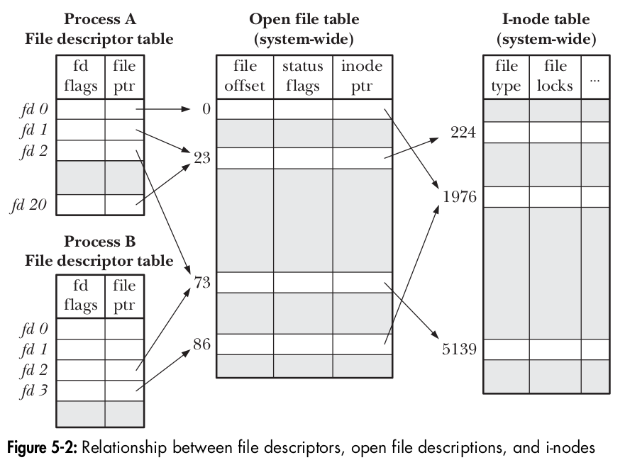
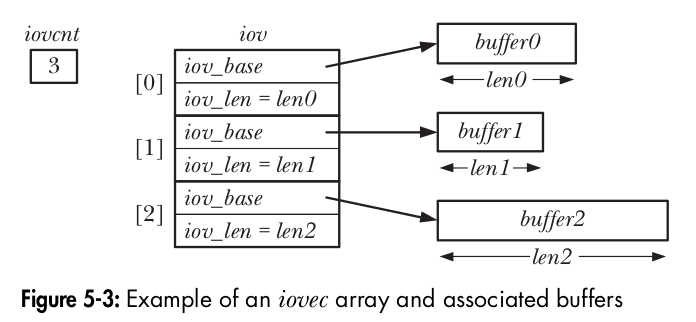

# CHEETSHEET FILE I/O
This contains my personal cheetsheet for FILE I/O syscalls encountered in **The Linux Programming Interface**.  
System calls are gateways to executing code in kernel space. It is the interface provided by the OS
to do some work (which usually requires privileges) on the behalf of a calling process. 
* Performing a system call alters the CPU's mode of execution to a higher privileged mode, this make
  sense as the system call code to be executed in  present in the kernel space which itself is a 
  privileged area of memory.  
* All system calls are executed atomically (meaning all steps are completed as a single operation 
  without being interrupted by another process or thread).
* NOTE: RACE CONDITIONS - The fact that the outcome of some operations depends on the order of scheduling of the two processes means that this is a race condition.
 
## I/O on Large Files (O_LARGEFILE)
Defining the below given macro will automatically convert all calls to file I/O functions into its equivalent LFS (Large File Summit) versions. For eg: a call to `open()` will automatically be replaced with `open64()`.  

**NOTE**: Just make sure to use system defined data types (eg: off_t rather than uin64_t for storing offset) writing clean portable code to work without any problems with large files.
```
#define _FILE_OFFSET_BITS 64
```

## FILE I/O (Universal File I/O model)
There are 3 data structures maintained by the kernel - 
* per-process **file descriptor table**
* system-wide **open file table** (**a table of open file descriptions**).
* filesystem **i-node table**.



```
#include <sys/stat.h>       /* for open|creat */
#include <fcntl.h>          /* for open|creat|fcntl */

#include <unistd.h>         /* for read|write|close|lseek dup|pread|pwrite truncate|ftruncate */

#include <stdlib.h>         /* for mkstemp */
#include <stdio.h>          /* for tmpfile */

#include <sys/ioctl.h>      /* for ioctl */
#include <sys/uio.h>        /* for scatter-gather I/O: readv|writev preadv|pwritev */
```

* int **`open`** (const char \*pathname, int flags, mode_t mode)  
~ *returns a file descriptor (success) or, -1 (failure).*
    
   
 

* int **`creat`** (const char *pathname, mode_t mode);  
~ equivalent to:  `fd = open(pathname, O_WRONLY | O_CREAT | O_TRUNC, mode);`
 
* ssize_t **`read`** (int fd, void *buffer, size_t count);  
~ returns number of bytes read, 0 on EOF or, -1 on error.

* ssize_t **`write`** (int fd, void *buffer, size_t count);  
~ returns number of bytes written, or -1 on error.

* int **`close`** (int fd);  
~ returns -1 on error.

* off_t **`lseek`** (int fd, off_t offset, int whence);  
~ For each open file, the kernel records a *file offset* (aka *read-write pointer*/*offset*) which is the location at which next read() or write() will begin (it is updated at each read() and write() syscall). lseek has the sole purpose of repositioning/adjusting the kernel's record of the *file offset* value associated with the open file descriptor (fd). It returns *new file offset* if successful, or -1 on error.
  
**NOTE** - lseek'ing and writing data past the EOF creates a **hole** in the file which can be programatically accessed but is *not allocated* any physical block space on disk. The file created is known as a **sparse file**.

* int **`fallocate`** (int fd, int mode, off_t offset, off_t len);  
~ A Linux specific syscall to allocate disk-space (in the form of disk blocks) for the hole (if any) in sparse files (files whose actual size is larger than on-disk space it consumes). After a successful call, any subsequent write to any hole byte in the file guaranteed not to fail because of lack of disk space (which may possibly happen when we try to write to a hole in any sparse file).

* int **posix_fallocate** (int fd, off_t offset, off_t len);  
~ A *glibc library function* which is a portable form of fallocate() syscall.

* int **`ioctl`** (int fd, int request, ... /* argp */);  
~ This syscall is used to perform all file & device operations that fall outside of the *universal I/O model (i.e. open/read/write/close since all file types & device drivers implement the same I/O interface allows for universality of I/O using these syscalls)*. Its return value depends on request, or -1 on error.

* int **`fcntl`** (int fd, int cmd, ...);  
~ File control (fcntl) operations is a multipurpose syscall that provides a range of 'control operations' on an already opened file.  
~ One use of fcntl is to *get* and *modify* file status flags of opened file.  
~ Other use can be duplication of file descriptors (F_DUPFD) which unlike dup syscall duplicates the oldfd by using lowest unused file descriptor >= startfd.
```  
flags = fcntl (fd, F_GETFL);    // getting current open status flags for  fd  
if (flags & O_SYNC);            // writes are synchronized    

flags |= O_APPEND;              // adding APPEND flag  
fnctl(fd, F_SETFL, flags);      // setting flag for already opened file fd  

newfd = fcntl (oldfd, F_DUPFD, startfd);          // duplicating file descriptor
newfd = fcntl (oldfd, F_DUPFD_CLOEXEC, startfd);  // duplicates + sets FD_CLOEXEC for the newfd
```

* int **`dup`** (int oldfd);  
~ Returns a new file descriptor (pointing the file description of oldfd in *system-wide open file table*) on success or -1 on failure. Always, the lowest unused file descriptor is returned.

* int **`dup2`** (int oldfd, int newfd);  
~ To ensure we always get the file descriptor we want (in contrast to *dup*), use dup2. It returns the (new) file descriptor (i.e. value passed in newfd) on success or -1 on failure. If newfd is already open, dup2 closes it (any error closing already opened newfd is silently ignored, so it is always safer approach to close the newfd before calling dup2).   
~ Here, `newfd = open file description of[oldfd]`

* int **`dup3`** (int oldfd, int newfd, int flags);  
~ same as dup2 syscall. Additionally it can modify behavior for duplication of file descriptor by specifying flags (which currently only can have a value of O_CLOEXEC, see open(2) for usefulness).

* ssize_t **`pread`** (int fd, void *buf, size_t count, off_t offset);  
~ same as read syscall except that I/O is performed at location specified by *offset* rather than current file offset.  
~ **NOTE**: The *current file offset* (associated with the file descriptor) is left unchanged by this syscall.  
~ returns number of bytes read, 0 on EOF, or -1 on error.

* ssize_t **`pwrite`** (int fd, const void *buf, size_t count, off_t offset);  
~ I/O performed same as pread above.  
~ returns number of bytes written, or -1 on error.

* ssize_t **`readv`** (int fd, const struct iovec *iov, int iovcnt);  
~ It performs *scatter input* (scatter means place) to transfer multiple buffers of data in an atomic operation (unlike read/write which can transfer only a single buffer of data). The set of buffers to be transferred is defined by the array *iov* having *iocnt* number of elements in it.  
~ It performs its operations sequencially starting from *iov[0]*.  
~ kernel completes all these operations (i.e. multiple data transfers between fd and user-process memory) *atomically* (i.e. in an atomic operation) as seen by the user-process.  
~ returns number of bytes read, 0 on EOF, or -1 on error.

```
struct iovec {
  void    *iov_base;    /* start address of buffer */
  size_t  iov_len;      /* number of bytes to transfer to/from buffer */
}
```



* ssize_t **`writev`** (int fd, const struct iovec *iov, int iocnt);   
~ It performs *gather output* since it concatenates (gathers) data from all the buffers specified by *iov* and writes the sequence of contiguous bytes to the file referred to by *fd*.  
~ returns number of bytes written, or -1 on error.

* ssize_t **`preadv`** (int fd, const struct iovec *iov, int iovcnt, off_t offset);  
~ A non-standard syscall that requires *_BSD_SOURCE* (feature test macro) to perfrom *scatter input* starting from a particular location (specified by *offset*) in file rather than current file offset (associated with fd) (as done by readv).

* ssize_t **`pwritev`** (int fd, const struct iovec *iov, int iovcnt, off_t offset);  
~ A non-standard syscall that requires *_BSD_SOURCE* (feature test macro) to perform *gather output* starting from a particular location (specified by *offset*) in file rather than current file offset (as done by writev).

* int **`truncate`** (const char *pathname, off_t length);  
~ It sets the size of file (in bytes) to value specified by *length*. If filesize > length, data is lost. If filesize < length, a *hole* is created.   
~ If pathname is a symbolic link, it is dereferenced.  
~ returns 0 on success, or -1 on failure.  

* int **`ftruncate`** (int fd, off_length);  
~ same as truncate requiring a file descriptor (fd) rather than a pathname.  
~ This call doesn't change the *file offset* associated with fd.

* int **`mkstemp`** (char *template);  
~ returns a file descriptor on success, or -1 on error.  
~ It creates a temporary file with the name supplied via *template*. The *template* argument must be a pathname where last 6 characters must be XXXXXX.
```
char template[] = "/tmp/customnameXXXXXX";

fd = mkstemp (template);
unlink (template);      /* name disappears immediately, but the file
                           is removed only after close() */
```

* FILE \***tmpfile** (void);  
~ A standard *library function* that creates a uniquely named temporary file that is opened for reading and writing (using O_EXCL flag).  
~ On success, it returns a FILE stream that can be used with other stdio library functions. The temporary file is automatically deleted when it is closed (by internally calling unlink()).

---