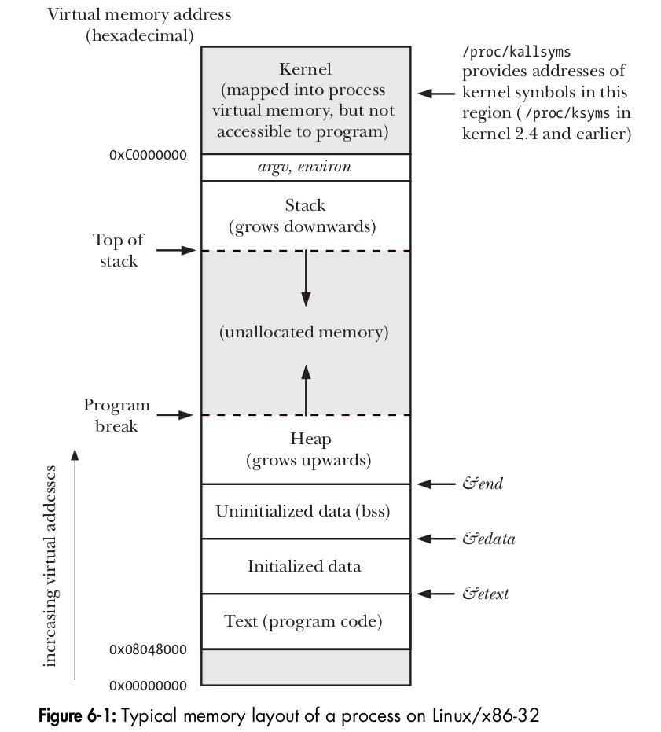
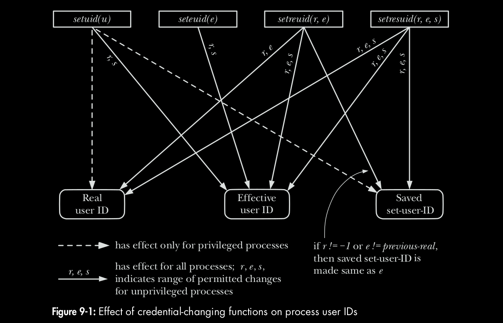
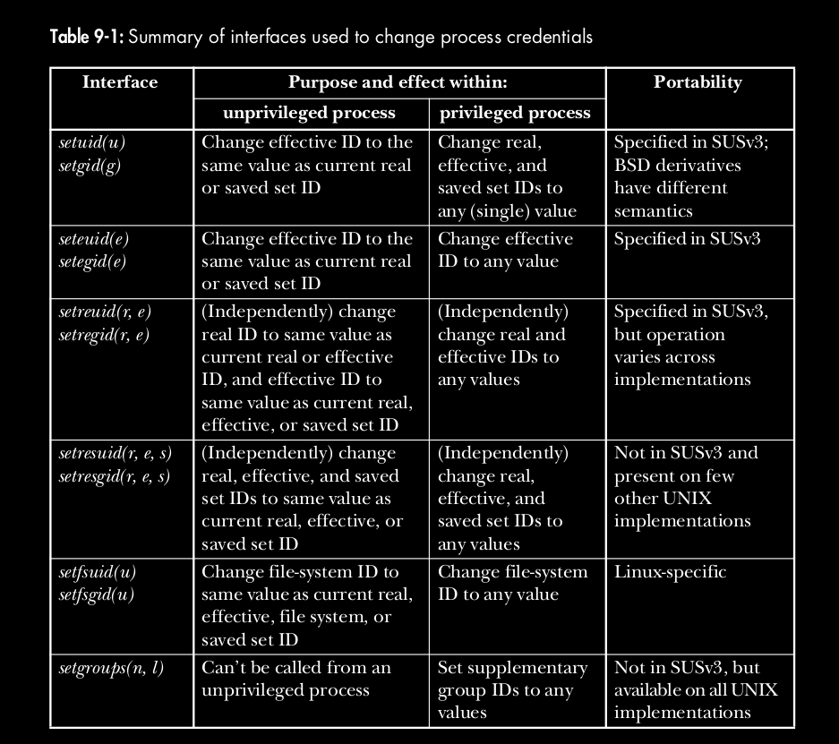

# **CHEETSHEET PROCESSES, SYSTEM INFORMATION AND PROCESS CREDENTIALS**
This contains my personal cheetsheet for syscalls related to processes encountered in **The Linux Programming Interface**.  


## **PROCESSES**
C programming environment provides 3 global symbols that represent one byte past the end of text, data and uninitialized data segment -
```
extern char etext, edata, end;  /* For example, &etext gives the address of the end of the program text / start of initialized data */

extern char **environ;          /* variable pointing to the environment list */
```
 
* The file `/proc/sys/kernel/pid_max` (2**22 for 64 bit Linux) stores one greater than the maximum PID any process can have. After this value, the kernel starts assigning PIDs again starting from 300.
* `/proc/kallsyms` provides addresses of all symbols in kernel space
* `/proc/PID/cmdline` can be used to access cmd-line arguments of any process.
* `/proc/PID/environ` contains the environment list for a process.
* pstree
* size <binary_exe>

```
#include <unistd.h>         /* for getpid */
#include <stdlib.h>         /* for getenv|putenv|setenv|unsetenv|clearenv */

#include <setjmp.h>         /* for setjmp|longjmp */
```

* pid_t **`getpid`** (void);  
~ always successfully return PID of caller process.

* pid_t **`getppid`** (void);  
~ always successfully return the PID of parent for caller process.

* char \***`getenv`** (const char *name);  
~ returns pointer to (value) string, or NULL if no such variable.

* int **`putenv`** (char *string);  
~ The *string* argument is a pointer to a string of the form "name=value". After this call, the *string* is a part of the environment (therefore, ensure that it is not an automatic variable array, i.e. should not be local to a function).  
~ returns a non-zero value on error (not -1).  

* int **`setenv`** (const char *name, const char *value, int overwrite);  
~ better than putenv (I guess).  
~ returns 0 on success, or -1 on error.

* int **`unsetenv`** (const char *name);  
~ removes environment variable *name* from environment list.  
~ returns 0 on success, or -1 on error.  

* int **`clearenv`** (void);  
~ clears the entire environement. A `#define _BSD_SOURCE` feature test macro 
~ returns 0 on success, or non-zero value on error.   
```
environ = NULL;         // this way we can clear up the environment
``` 

* int **`setjmp`** (jmp_buf env);  
~ returns 0 on initial call, nonzero (*val*) on return via longjmp().

* void **`longjmp`** (jmp_buf env, int val);  

---

## **PROCESS CREDENTIALS (man 7 credentials)**
Every process has a set of associated **credentials** in the form of numeric *UIDs* & *GIDs*. These are as follows - 

```
* real user ID and group ID;
* effective user ID and group ID;
* saved set-user-ID and saved set-group-ID;
* file-system user ID and group ID (Linux-specific); and
* supplementary group IDs.
```

### **Real UID & GID**
Idenfiy *belonging* of a process in terms of *who executed/invoked the program*, i.e. tells us **who ran the program**. When a process is created, it inherits these identifiers from its parent process (eg: a login shell launches a program which inherits its UID & GID from shell which at the time of login gets its credentials from `/etc/passwd` file)  


### **Effective UID & GID**
These identifiers determine the **privileges granted to a process**, in other words permissions granted to a process when it accesses resources, such as files, IPC objects (which themselves have associated UIDs & GIDs). A process whose effective user ID is 0 (the user ID of root) has all of the privileges of the superuser and therefore is known as **privileged process**.     
There are two ways in which the effective IDs can assume different values than real IDs -
* via use of system calls.
* via execution of set-user-ID (**suid**) and set-group-ID (**sgid**) programs. They set the process's euid to **UID of the owner** of **executable** binary. Using *chmod* (`chmod u+s prog; chmod g+s prog `), an unprivileged user can set these bits for files that they own. A privileged user ( CAP_FOWNER ) can set these bits for any file. Running SUID programs simply mean - **create a process for this program on behalf of the owner of this program**.

### **Saved Set-User-ID and Saved Set-Group-ID**
The saved set-user-ID and saved set-group-ID store the values copied from effective user-ID (euid/egid) during operations of a process. They are designed for use with **suid** and **sgid** programs. When a program is executed, the following steps (among many others) occur -
* If the set-user-ID (set-group-ID) permission bit is enabled on the executable, then the effective user (group) ID of the process is made the same as the owner of the executable.  
**NOTE**: If the set-user-ID (set-group-ID) bit is not set, then no change is made to the effective user (group) ID of the process.
* The values for the saved **set-user-ID** and **saved set-group-ID** are copied from the corresponding effective IDs. This copying occurs regardless of whether the set-user-ID or set-group-ID bit is set on the file being executed.

### **File-System User ID and File-System Group ID**
On Linux, different ID's were introduced for filesystem operations, i.e. the file-system user and group IDs are used (in conjunction with the supplementary group IDs), rather than the effective user and group IDs, to determine permissions when performing file-system operations such as opening files, changing file ownership, and modifying file permissions.  
* Nowadays, filesystem UIDs/GIDs concept is rarely used (due to SUSv3-mandated rules regarding *permission for sending signals* since Linux kernel 2.0 onwards) and they are almost always set to the effective UID of the process whenever the effective user or group ID is changed, either by a system call or by execution of a set-user-ID or set-group-ID program, the corresponding file-system ID is also changed to the same value.

Syscalls for setting filesystem UID/GID: **`setfsuid()`** and **`setfsgid()`**.

### **Supplementary Group IDs (/etc/group)**
The supplementary group IDs are a **set of additional groups** to which a process belongs. A new process inherits these IDs from its parent. 
* These IDs are used in conjunction with the effective and file-system IDs to determine permissions for accessing files, System V IPC objects, and other system resources.



### **INTERFACE**
* As an alternative to using the system calls described in the following pages, the **credentials of any process** can be found by examining the Uid , Gid , and Groups lines provided in the Linux-specific **`/proc/PID/status`** file. The Uid and Gid lines list the identifiers in the order **real, effective, saved set, and file system**.

```
#define _GNU_SOURCE     /* getresuid|getresgid */

#include <grp.h>        /* setgroups|initgroups */
#include <unistd.h>     /* getuid|geteuid | getguid|getegid
                           setuid|setguid | seteuid|setegid 
                           setreuid|setregid 
                           getresuid|getresgid
                           setresuid|setresgid
                           getgroups|setgroups|initgroups
                        */

#include <sys/fsuid.h>  /* setfsuid|setfsgid */
```



* uid_t **`getuid`** (void);  
~ Returns real user ID of calling process.

* uid_t **`geteuid`** (void);  
~ Returns effective user ID of calling process.

* gid_t **`getgid`** (void);  
~ Returns real group ID of calling process.

* gid_t **`getegid`** (void);  
~ Returns effective group ID of calling process.


* int **`setuid`** (uid_t uid );  
~ Changes the effective user-ID (only euid is changed if process is unprivileged) and possibly the real user ID and the saved set-user-ID—of the calling process to the value given by the uid argument.  
~ Return 0 on success, or –1 on error.  
~ Rules are as follows:
```
1. An unprivileged process can set any of its real user ID, effective user ID, and saved set-user-ID to any of the values currently in its current real user ID, effective user ID, or saved set-user-ID.

2. A privileged process can make arbitrary changes to its real user ID, effective user ID, and saved set-user-ID.

3. Regardless of whether the call makes any changes to other IDs, the file-system user ID is always set to the same value as the (possibly new) effective user ID.
```

* int **`setgid`** (gid_t gid );   
~ Analogous to setuid().  
~ Return 0 on success, or –1 on error.


* int **`seteuid`** (uid_t euid );  
~ Set effective UID to *euid*. For underprivileged processes, it may be set only to corresponding value of either real UID or saved set UID.
~ Return 0 on success, or –1 on error


* int **`setegid`** (gid_t egid );
~ Set effective GID to *egid*.   
~ Return 0 on success, or –1 on error

```
/* DROP AND REGAIN PRIVILEGES */

euid = geteuid();               /* Save initial effective user ID (which
                                is same as saved set-user-ID) */
if (seteuid(getuid()) == -1)    /* Drop privileges */
errExit("seteuid");
if (seteuid(euid) == -1)        /* Regain privileges */
errExit("seteuid");
```

* int **`setreuid`** (uid_t ruid , uid_t euid );  
~ The first argument to each of these system calls is the new real ID. The second argument is the new effective ID. If we want to change only one of the identifiers, then we can specify –1 for the other argument.  
~ Following rules govern the changes that we can make using setreuid() and setregid()
```
1. An unprivileged process can set the real user ID only to the current value of the real (i.e., no change) or effective user ID. The effective user ID can be set only to the current value of the real user ID, effective user ID (i.e., no change), or saved set-user-ID.

2. A privileged process can make any changes to the IDs.

3. For both privileged and unprivileged processes, the saved set-user-ID is also set to the same value as the (new) effective user ID if either of the following is true: 
    a)  ruid is not –1 (i.e., the real user ID is being set, even to the same value it already had), or
    b)  the effective user ID is being set to a value other than the value of the real user ID prior to the call.

```

* int **`setregid`** (gid_t rgid , gid_t egid );  
~ Analogous to setreuid().

* int **`getresuid`** (uid_t * ruid , uid_t * euid , uid_t * suid );  
~ The getresuid() system call returns the current values of the calling process’s real user ID, effective user ID, and saved set-user-ID in the locations pointed by its three arguments.  
~ Return 0 on success, or –1 on error

* int **`getresgid`** (gid_t * rgid , gid_t * egid , gid_t * sgid );  
~ Analogous to getresuid().

* int **`setresuid`** (uid_t * ruid , uid_t * euid , uid_t * suid );   
~ The setresuid() system call allows the calling process to independently change the values of all three of its user IDs. If we don’t want to change all of the identifiers, then specifying –1 for an argument leaves the corresponding identifier unchanged.  
~ Return 0 on success, or –1 on error


* int **`setresgid`** (gid_t * rgid , gid_t * egid , gid_t * sgid );  
~ Analogous to setresuid().


* int **`setfsuid`** (uid_t fsuid);  
~ Always return the previous file-system UID.

* int **`setfsgid`** (gid_t fsgid);  
~ Always return the previous file-system GID.


* int **`getgroups`** (int gidsetsize, gid_t grouplist[]);   
~ Simply returns the calling process’s supplementary group IDs. The calling program must allocate the grouplist array and specify its length in the argument gidsetsize.  
~ Returns number of group IDs placed in grouplist on success, or –1 on error.


* int **`setgroups`** (size_t gidsetsize, const gid_t *grouplist);  
~ The setgroups() system call replaces the calling process’s supplementary group IDs with the set given in the array grouplist. The gidsetsize argument specifies the number of group IDs in the array argument grouplist.  
~ Return 0 on success, or –1 on error

* int **`initgroups`** (const char *user, gid_t group);  
~ The initgroups() function initializes the calling process’s supplementary group IDs by scanning /etc/groups and building a list of all groups of which the named user is a member. In addition, the group ID specified in group is also added to the process’s set of supplementary group IDs.  
~ Return 0 on success, or –1 on error


---
