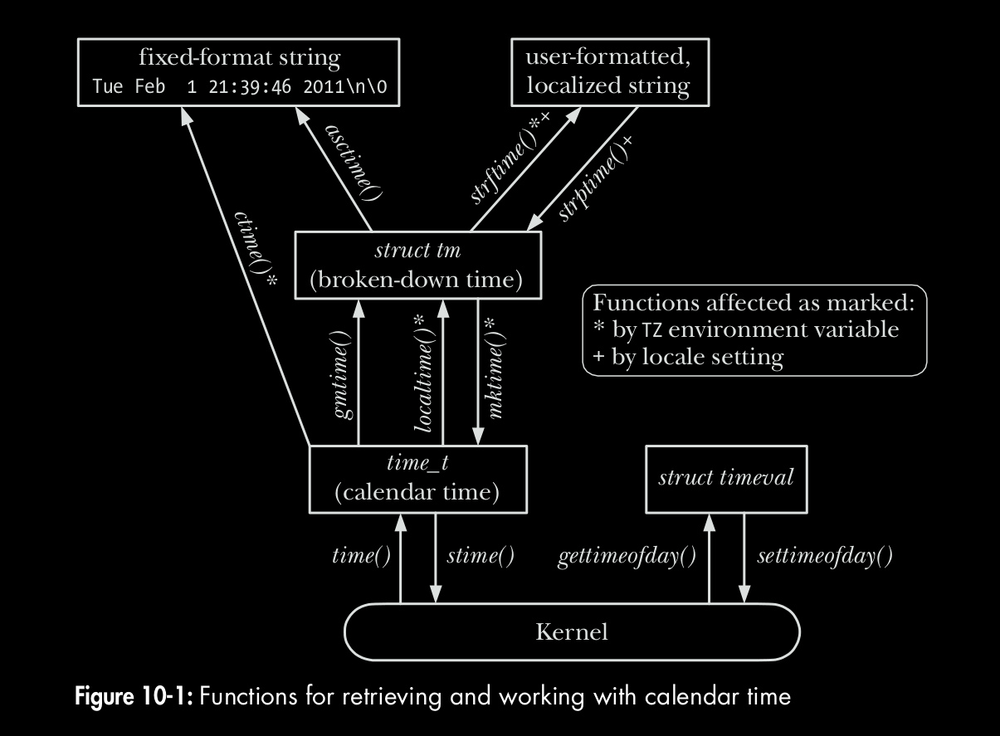
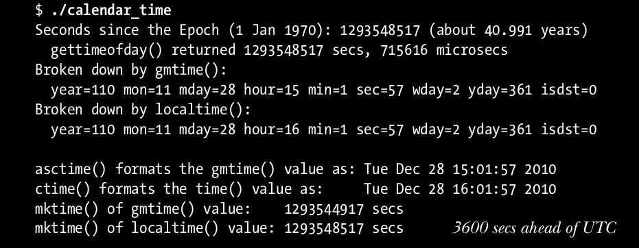

# **CHEETSHEET PROCESSES|CREDENTIALS, MEMORY MANAGEMENT, USERS & GROUPS, TIME**
This contains my personal cheetsheet for syscalls related to processes encountered in **The Linux Programming Interface**.  


## **PROCESSES**
C programming environment provides 3 global symbols that represent one byte past the end of text, data and uninitialized data segment -
```
extern char etext, edata, end;  /* For example, &etext gives the address of the end of the program text / start of initialized data */

extern char **environ;          /* variable pointing to the environment list */
```
 
* The file `/proc/sys/kernel/pid_max` (2**22 for 64 bit Linux) stores one greater than the maximum PID any process can have. After this value, the kernel starts assigning PIDs again starting from 300.
* `/proc/kallsyms` provides addresses of all symbols in kernel space
* `/proc/PID/cmdline` can be used to access cmd-line arguments of any process.
* `/proc/PID/environ` contains the environment list for a process.
* pstree
* size <binary_exe>

```
#include <unistd.h>         /* for getpid */
#include <stdlib.h>         /* for getenv|putenv|setenv|unsetenv|clearenv */

#include <setjmp.h>         /* for setjmp|longjmp */
```

* pid_t **`getpid`** (void);  
~ always successfully return PID of caller process.

* pid_t **`getppid`** (void);  
~ always successfully return the PID of parent for caller process.

* char \***`getenv`** (const char *name);  
~ returns pointer to (value) string, or NULL if no such variable.

* int **`putenv`** (char *string);  
~ The *string* argument is a pointer to a string of the form "name=value". After this call, the *string* is a part of the environment (therefore, ensure that it is not an automatic variable array, i.e. should not be local to a function).  
~ returns a non-zero value on error (not -1).  

* int **`setenv`** (const char *name, const char *value, int overwrite);  
~ better than putenv (I guess).  
~ returns 0 on success, or -1 on error.

* int **`unsetenv`** (const char *name);  
~ removes environment variable *name* from environment list.  
~ returns 0 on success, or -1 on error.  

* int **`clearenv`** (void);  
~ clears the entire environement. A `#define _BSD_SOURCE` feature test macro 
~ returns 0 on success, or non-zero value on error.   
```
environ = NULL;         // this way we can clear up the environment
``` 

* int **`setjmp`** (jmp_buf env);  
~ returns 0 on initial call, nonzero (*val*) on return via longjmp().

* void **`longjmp`** (jmp_buf env, int val);  

---

## **PROCESS CREDENTIALS (man 7 credentials)**
Every process has a set of associated **credentials** in the form of numeric *UIDs* & *GIDs*. These are as follows - 

```
* real user ID and group ID;
* effective user ID and group ID;
* saved set-user-ID and saved set-group-ID;
* file-system user ID and group ID (Linux-specific); and
* supplementary group IDs.
```

### **Real UID & GID**
Idenfiy *belonging* of a process in terms of *who executed/invoked the program*, i.e. tells us **who ran the program**. When a process is created, it inherits these identifiers from its parent process (eg: a login shell launches a program which inherits its UID & GID from shell which at the time of login gets its credentials from `/etc/passwd` file)  


### **Effective UID & GID**
These identifiers determine the **privileges granted to a process**, in other words permissions granted to a process when it accesses resources, such as files, IPC objects (which themselves have associated UIDs & GIDs). A process whose effective user ID is 0 (the user ID of root) has all of the privileges of the superuser and therefore is known as **privileged process**.     
There are two ways in which the effective IDs can assume different values than real IDs -
* via use of system calls.
* via execution of set-user-ID (**suid**) and set-group-ID (**sgid**) programs. They set the process's euid to **UID of the owner** of **executable** binary. Using *chmod* (`chmod u+s prog; chmod g+s prog `), an unprivileged user can set these bits for files that they own. A privileged user ( CAP_FOWNER ) can set these bits for any file. Running SUID programs simply mean - **create a process for this program on behalf of the owner of this program**.

### **Saved Set-User-ID and Saved Set-Group-ID**
The saved set-user-ID and saved set-group-ID store the values copied from effective user-ID (euid/egid) during operations of a process. They are designed for use with **suid** and **sgid** programs. When a program is executed, the following steps (among many others) occur -
* If the set-user-ID (set-group-ID) permission bit is enabled on the executable, then the effective user (group) ID of the process is made the same as the owner of the executable.  
**NOTE**: If the set-user-ID (set-group-ID) bit is not set, then no change is made to the effective user (group) ID of the process.
* The values for the saved **set-user-ID** and **saved set-group-ID** are copied from the corresponding effective IDs. This copying occurs regardless of whether the set-user-ID or set-group-ID bit is set on the file being executed.

### **File-System User ID and File-System Group ID**
On Linux, different ID's were introduced for filesystem operations, i.e. the file-system user and group IDs are used (in conjunction with the supplementary group IDs), rather than the effective user and group IDs, to determine permissions when performing file-system operations such as opening files, changing file ownership, and modifying file permissions.  
* Nowadays, filesystem UIDs/GIDs concept is rarely used (due to SUSv3-mandated rules regarding *permission for sending signals* since Linux kernel 2.0 onwards) and they are almost always set to the effective UID of the processwhenever the effective user or group ID is changed, either by a system call or by execution of a set-user-ID or set-group-ID program, the corresponding file-system ID is also changed to the same value.

Syscalls for setting filesystem UID/GID: **`setfsuid()`** and **`setfsgid()`**.

### **Supplementary Group IDs (/etc/group)**
The supplementary group IDs are a **set of additional groups** to which a process belongs. A new process inherits these IDs from its parent. 
* These IDs are used in conjunction with the effective and file-system IDs to determine permissions for accessing files, System V IPC objects, and other system resources.


### **INTERFACE**
* As an alternative to using the system calls described in the following pages, the **credentials of any process** can be found by examining the Uid , Gid , and Groups lines provided in the Linux-specific **`/proc/PID/status`** file. The Uid and Gid lines list the identifiers in the order **real, effective, saved set, and file system**.

```
#define _GNU_SOURCE     /* getresuid|getresgid */

#include <grp.h>        /* setgroups|initgroups */
#include <unistd.h>     /* getuid|geteuid | getguid|getegid
                           setuid|setguid | seteuid|setegid 
                           setreuid|setregid 
                           getresuid|getresgid
                           setresuid|setresgid
                           getgroups|setgroups|initgroups
                        */

#include <sys/fsuid.h>  /* setfsuid|setfsgid */
```


* uid_t **`getuid`** (void);  
~ Returns real user ID of calling process.

* uid_t **`geteuid`** (void);  
~ Returns effective user ID of calling process.

* gid_t **`getgid`** (void);  
~ Returns real group ID of calling process.

* gid_t **`getegid`** (void);  
~ Returns effective group ID of calling process.


* int **`setuid`** (uid_t uid );  
~ Changes the effective user-ID (only euid is changed if process is unprivileged) and possibly the real user ID and the saved set-user-ID—of the calling process to the value given by the uid argument.  
~ Return 0 on success, or –1 on error.  
~ Rules are as follows:
```
1. An unprivileged process can set any of its real user ID, effective user ID, and saved set-user-ID to any of the values currently in its current real user ID, effective user ID, or saved set-user-ID.

2. A privileged process can make arbitrary changes to its real user ID, effective user ID, and saved set-user-ID.

3. Regardless of whether the call makes any changes to other IDs, the file-system user ID is always set to the same value as the (possibly new) effective user ID.
```

* int **`setgid`** (gid_t gid );   
~ Analogous to setuid().  
~ Return 0 on success, or –1 on error.


* int **`seteuid`** (uid_t euid );  
~ Set effective UID to *euid*. For underprivileged processes, it may be set only to corresponding value of either real UID or saved set UID.
~ Return 0 on success, or –1 on error


* int **`setegid`** (gid_t egid );
~ Set effective GID to *egid*.   
~ Return 0 on success, or –1 on error

```
/* DROP AND REGAIN PRIVILEGES */

euid = geteuid();               /* Save initial effective user ID (which
                                is same as saved set-user-ID) */
if (seteuid(getuid()) == -1)    /* Drop privileges */
errExit("seteuid");
if (seteuid(euid) == -1)        /* Regain privileges */
errExit("seteuid");
```

* int **`setreuid`** (uid_t ruid , uid_t euid );  
~ The first argument to each of these system calls is the new real ID. The second argument is the new effective ID. If we want to change only one of the identifiers, then we can specify –1 for the other argument.  
~ Following rules govern the changes that we can make using setreuid() and setregid()
```
1. An unprivileged process can set the real user ID only to the current value of the real (i.e., no change) or effective user ID. The effective user ID can be set only to the current value of the real user ID, effective user ID (i.e., no change), or saved set-user-ID.

2. A privileged process can make any changes to the IDs.

3. For both privileged and unprivileged processes, the saved set-user-ID is also set to the same value as the (new) effective user ID if either of the following is true: 
    a)  ruid is not –1 (i.e., the real user ID is being set, even to the same value it already had), or
    b)  the effective user ID is being set to a value other than the value of the real user ID prior to the call.

```

* int **`setregid`** (gid_t rgid , gid_t egid );  
~ Analogous to setreuid().

* int **`getresuid`** (uid_t * ruid , uid_t * euid , uid_t * suid );  
~ The getresuid() system call returns the current values of the calling process’s real user ID, effective user ID, and saved set-user-ID in the locations pointed by its three arguments.  
~ Return 0 on success, or –1 on error

* int **`getresgid`** (gid_t * rgid , gid_t * egid , gid_t * sgid );  
~ Analogous to getresuid().

* int **`setresuid`** (uid_t * ruid , uid_t * euid , uid_t * suid );   
~ The setresuid() system call allows the calling process to independently change the values of all three of its user IDs. If we don’t want to change all of the identifiers, then specifying –1 for an argument leaves the corresponding identifier unchanged.  
~ Return 0 on success, or –1 on error


* int **`setresgid`** (gid_t * rgid , gid_t * egid , gid_t * sgid );  
~ Analogous to setresuid().


* int **`setfsuid`** (uid_t fsuid);  
~ Always return the previous file-system UID.

* int **`setfsgid`** (gid_t fsgid);  
~ Always return the previous file-system GID.


* int **`getgroups`** (int gidsetsize, gid_t grouplist[]);   
~ Simply returns the calling process’s supplementary group IDs. The calling program must allocate the grouplist array and specify its length in the argument gidsetsize.  
~ Returns number of group IDs placed in grouplist on success, or –1 on error.


* int **`setgroups`** (size_t gidsetsize, const gid_t *grouplist);  
~ The setgroups() system call replaces the calling process’s supplementary group IDs with the set given in the array grouplist. The gidsetsize argument specifies the number of group IDs in the array argument grouplist.  
~ Return 0 on success, or –1 on error

* int **`initgroups`** (const char *user, gid_t group);  
~ The initgroups() function initializes the calling process’s supplementary group IDs by scanning /etc/groups and building a list of all groups of which the named user is a member. In addition, the group ID specified in group is also added to the process’s set of supplementary group IDs.  
~ Return 0 on success, or –1 on error


---


## **MEMORY ALLOCATION**
The current limit of heap is referred to as the **`program break`**.

```
#include <unistd.h>         /* for brk|sbrk */
#include <stdlib.h>         /* for malloc|calloc|realloc|free|posix_memalign */
#include <malloc.h>         /* for memalign */

```

* int **`brk`** (void *end_data_segment);  
~ **Sets** the *program break* to the location specified by *end_data_segment*. Since virtual memory is allocated in units of pages, *end_data_segment* is effectively rounded up to the next page boundary.   
~ returns 0 on success, or -1 on error.  

* void \***`sbrk`** (intptr_t increment);  
~ **Adjusts** the *program break* by adding an *increment* to it.  
~ On success, returns the previous address of *program break*. On error, `(void *) -1` is returned.
```
sbrk(0);        // returns the current setting of program break without changing it.
```

* void \***`malloc`** (size_t size);  
~ Allocates *size* bytes from the heap and returns a (void *) pointer to the newly allocated block of memory on success, or NULL on errror. 

* void \***`calloc`** (size_t numitems, size_t size);  
~ Allocates memory for an array of identical items. The *numitems* identify how many items of *size* to allocate. Unlike malloc, it clears of the allocated memory to 0 bytes.
~ returns pointer to allocated memory on success, or NULL on error.

* void \***`realloc`** (void *ptr, size_t size);  
~ Used to *resize* a block of memory (previously allocated by one of the member functions of malloc family). The ptr argument is a pointer to the block of memory that is to be resized. The size argument specifies the desired new size of the block.  
~ Returns pointer to allocated memory on success, or NULL on error.

* void **`free`** (void *ptr);  
~ Deallocates the memory block (allocated by malloc family of functions) pointed to by *ptr*. Double-free has unpredictable results.   

* void \***`memalign`** (size_t boundary, size_t size);  
~ allocates *size* bytes starting at an address aligned to a multiple of *boundary* (which must be a power of 2).  
~ returns pointer to allocated memory on success, or NULL on error.

* int **`posix_memalign`** (void **memptr, size_t alignment, size_t size);  
~ The address of allocated memory is returned in `void *memptr` (whose address is passed in posix_memalign()). The memory is aligned to a multiple of alignment, which must be a power-of-two multiple of sizeof(void *) (4 or 8 bytes on most hardware architectures).  
~ Returns 0 on success, or a positive error number on error.  

* void \***`alloca`** (size_t size);  
~ Allocates space on *stack segment* (current function's stack frame by subtracting value from stack pointer).   
~ Returns a pointer to allocated block of memory.  


---

## **USERS AND GROUPS**

### **The Password File: /etc/passwd & /etc/shadow**  

> `abhinav:x:1000:100:Comment field for Abhinav's Account:/home/mtk:/bin/bash`  

* **Login name**: 'abhinav' is the unique name (username) which is a human-readable identifier corresponding to the UID.   
* **Encrypted password** :  The field contains a *13-character* encrypted password. If this password field contains any other string (longer than 13-chars, then it is not a valid encrypted password string and therefore the logins to this accound is disabled). If shadow-passwords are enabled, encrypted password is stored in `/etc/shadow` file (see `shadow(5)` manual page for details) and this field contains the char 'x' or nothing (an empty field means no password is required to login to this account). Usually password format is set to $**id**$**salt**$**hashed**, The $id is the algorithm used On GNU/Linux as follows:
```    
    $1$ is MD5
    $2a$ is Blowfish
    $2y$ is Blowfish
    $5$ is SHA-256
    $6$ is SHA-512 
```
**NOTE**: Use **pwck** (`man pwck`) to verify integrity of passwd files.
* **UID**: If user ID field stores a 0, this account has superuser privileges.  
* **GID**: Group ID of first of the groups to which user is the member. Further group membership information is stored in system groups file.  
* **Comment**: This field stores text about the user.  
* **Home directory**: stores the path to initial directory into which the user is placed after loging in.
* **Login shell**: This stores path of program to which control is transferred once the user is logged in.  

### **The Group File: /etc/group & /etc/gshadow**
For controlling access to files and system resources, it is useful to organize users into groups. The `/etc/group` file lists extra group membership for each user.  

> `hostel_room_158:x:106:compilepeace,gaurav,saurabh,biki`

* **Group Name**: symbolic representation of GID (similar to username).
* **Encrypted Password**: If shadowing is enabled, this field contains an 'x' and encrypted password is stored in shadow group file `/etc/gshadow` (which can only be accessed by privileged programs).
* **GID**: numeric ID for this group. A GID of 0 means the group has root privileges. 
* **User list**: comma-separated list of usernames who are members of this group.  
```
To record that the user avr is a member of the groups users, staff, and teach, we
would see the following record in the password file:
    avr:x:1001:100:Anthony Robins:/home/avr:/bin/bash

And the following records would appear in the group file:
    users:x:100:
    staff:x:101:mtk,avr,martinl
    teach:x:104:avr,rlb,alc
```

```
/* Library functions */

#define _BSD_SOURCE     /* Get getpass() declaration from <unistd.h> */
#define _XOPEN_SOURCE   /* Get crypt() declaration from <unistd.h> */
#define 

#include <sys/types.h>

#include <pwd.h>        /* for getpwnam|getpwuid | getpwent|setpwent|endpwent */
#include <grp.h>        /* for getgrnam|getgrgid | getgrent|setgrent|endgrent */
#include <shadow.h>     /* for getspnam          | getspent|setspent|endspent */

#include <unistd.h>     /* for  getpass|crypt (compile with –lcrypt option to 
                           link against crypt library) */

struct passwd {
char *pw_name;      /* Login name (username) */
char *pw_passwd;    /* Encrypted password (if not password shadowing) */
uid_t pw_uid;       /* User ID */
gid_t pw_gid;       /* Group ID */
char *pw_gecos;     /* Comment (user info) */
char *pw_dir;       /* Initial working (home) directory */
char *pw_shell;     /* Login shell */
};


struct group {
char *gr_name;      /* Group name */
char *gr_passwd;    /* Encrypted password (if not password shadowing) */
gid_t gr_gid;       /* Group ID */
char **gr_mem;      /* NULL-terminated array of pointers to names
                       of members listed in /etc/group */
};


struct spwd {
char *sp_namp;      /* Login name (username) */
char *sp_pwdp;      /* Encrypted password */

/* Remaining fields support "password aging", an optional
feature that forces users to regularly change their
passwords, so that even if an attacker manages to obtain
a password, it will eventually cease to be usable. */

long sp_lstchg;     /* Time of last password change (days since 1 Jan 1970) */
long sp_min;        /* Min. number of days between password changes */
long sp_max;        /* Max. number of days before change required */
long sp_warn;       /* Number of days beforehand that user is
                       warned of upcoming password expiration */
long sp_inact;      /* Number of days after expiration that account
                       is considered inactive and locked */
long sp_expire;     /* Date when account expires
                       (days since 1 Jan 1970) */
unsigned long sp_flag;      /* Reserved for future use */
};
```

* struct passwd \***`getpwnam`** (const char *name);  
~ Given a *login name* in *name*, it finds the relevant field in passwd file and returns a *statically allocated  passwd structure* (which is overwritten on each call to one of these functions) (as defined below) on success, or NULL on error (and also if no entry by this *name* is found).  
~ The *pw_passwd* field contains a valid info. only if password shadowing is enabled (Programmatically, the simplest way to determine whether password shadowing is enabled is to follow a successful getpwnam() call with a call to getspnam()).  
~ Returns a pointer to a passwd structure, or NULL  if  the matching entry is not found or an error occurs.  


* struct passwd \***`getpwuid`** (uid_t uid);  
~ The getpwuid() function returns exactly the same information as getpwnam(), but does a lookup using the numeric user ID supplied in the argument uid.  
~ Returns a pointer to a passwd structure, or NULL  if  the matching entry is not found or an error occurs.

* struct group \***`getgrnam`** (const char *name);   
~ The getgrnam() function looks up group information by group name, and the getgrgid() function performs lookups by group ID. Both functions return a pointer to a *statically allocated group structure*.  
~ As with the corresponding password functions described above, this structure is  overwritten on each call to one of these functions.
~ return a pointer on success, or NULL on error (and not found case).


* struct group \***`getgrgid`** (gid_t gid);  
~ same as *getgrnam* except that it takes a *group ID* rather than a *group name* as parameter.

* struct spwd \***`getspnam`** (const char *name);  
~ fetches the *shadow passwd record* for *login name* identified by *name* parameter analogous to getpwnam().
<br>
<br>


> #### Sequencial Scanning of all Records in Passwd & Group files

* struct passwd \***`getpwent`** (void);  
~ Returns records from the passwd file one by one, returning NULL when there are no more records (or an error occurs).

```
// We can walk through all the records on by one
struct passwd *pwd;

while ( (pwd = getpwent()) != NULL) {
    printf ("%-8s %5ld\n", pwd->pw_name, (long )pwd->pw_uid);

endpwent();
}
```

* void **`setpwent`** (void);  
~ If we are part-way parsing through passwd file entries (with getpwent), we can call setpwent() to start from the beginning of passwd file (without reopening passwd file which is what endpwent will do). 

* void **`endpwent`** (void);  
~ After calling endpwent(), any call to getpwent() will *reopen* passwd file and start from the beginning.  

* struct group \***`getgrent`** (void);
* void **`setgrent`** (void);
* void **`endgrent`** (void);  

* struct spwd \***`getspent`** (void);
* void **`setspent`** (void);
* void **`endspent`** (void);

### **Password Encryption and User Authentication**

* char \***`crypt`** (const char *key, const char *salt);  
~ crypt() encapsulates the *one-way encryption algorithm* (which means there is no way of re-creating password from its encrypted form).  
~ crypt() takes in a *key* (i.e. the password) of up to **8 characters**, and applies a variation of **DES algorithm** (Data Encryption Standard) to it.  
~ The *salt* value is a **2 character** string whose value is used to vary the algorithm.  
~ The function returns a *pointer* to *statically allocated encrypted password*, i.e. a **13 character** string.  
~ Both the salt argument and the encrypted password are composed of characters selected from the 64-character set `[a-zA-Z0-9/.]`.  

* char \***`getpass`** (const char *prompt);  
~ The getpass() function first disables echoing and all processing of terminal special characters (such as Ctrl+c).  
~ It then prints the string pointed to by prompt, and reads a line of input, returning the null-terminated input string with the trailing newline stripped, as its function result.  
~ This string is statically allocated, and so will be overwritten on a subsequent call to getpass().   
~ Before returning, getpass() restores the terminal settings to their original states.  
~ Returns pointer to statically allocated input password string on success, or NULL on error.  

---

## **TIME**
A system programmer might be interested in one of the 2 kinds of time -
* **Real Time** : Calender time via architecture provided clock.
* **Process Time**



### **Interface**
```
_XOPEN_SOURCE               /* for strptime */
#include <sys/time.h>       /* gettimeofday|  */
#include <time.h>           /* time|ctime|
                               gmtime|localtime|mktime|
                               asctime|strftime|strptime */

```

```
struct timeval {
    time_t      tv_sec;     /* Number of seconds since epoch ( 00:00:00, 1 Jan 1970 UTC ) */
    suseconds_t tv_usec;    /* Additional microseconds (long int) */
}

struct tm {
int tm_sec;         /* Seconds (0-60) */
int tm_min;         /* Minutes (0-59) */
int tm_hour;        /* Hours (0-23) */
int tm_mday;        /* Day of the month (1-31) */      
int tm_mon;         /* Month (0-11) */
int tm_year;        /* Year since 1900 */
int tm_wday;        /* Day of the week (Sunday = 0)*/
int tm_yday;        /* Day in the year (0-365; 1 Jan = 0)*/
int tm_isdst;       /* Daylight saving time flag
                        > 0: DST is in effect;
                        = 0: DST is not effect;
                        < 0: DST information not available */
};

```



* int **`gettimeofday`** (struct timeval *tv, struct timezone *tz);   
~ The results are returned in 'tv'. Here 'tz' argument is now obsolete and should always be NULL.    
~ returns 0 on success, or -1 on error.

* time_t **`time`** (time_t *timep);  
~ If the timep argument is not NULL , the number of seconds since the Epoch is also placed in the location to which timep points.  
~ Returns number of seconds since the Epoch,or (time_t) –1 on error.    


#### **Convert time_t to Printable form**
* char \***`ctime`** (const time_t *timep);  
~ Provides a simple method of converting a time_t value into printable form.  
~ Returns pointer to statically allocated string (meaning the future calls will overwrite it) terminated by newline and \0 on success, or NULL on error.  

#### **Convert time_t to broken-down time & vice-versa**
* struct tm \***`gmtime`** (const time_t *timep);    
~ The gmtime() function converts a calendar time into a broken-down time corresponding to UTC. (The letters gm derive from **Greenwich Mean** Time.)  
~ return a pointer to a statically allocated broken-down time structure on success, or NULL on error.


* struct tm \***`localtime`** (const time_t *timep);  
~ In contrast to gmtime(), *localtime()* takes into account timezone and *DST (Daylight saving time) settings* to return a broken-down time corresponding to the **system’s local time**.   
~ return a pointer to a statically allocated broken-down time structure on success, or NULL on error.  


* time_t **`mktime`** (struct tm *timeptr);  
~ The mktime() function translates a *broken-down time* (struct tm), expressed as local time (by localtime()), into a time_t value, which is returned as the function result.  
~ Returns seconds since the Epoch corresponding to timeptr on success, or (time_t) –1 on error.

#### **Convert between broken-down time & Printable form**

* char \***`asctime`** (const struct tm *timeptr);  
~ Given a pointer to a broken-down time structure in the argument tm, asctime() returns a pointer to a statically allocated string containing the time in the same form as ctime().  
~ Returns pointer to statically allocated string terminated by newline and \0 on success, or NULL on error


* size_t **`strftime`** (char *outstr, size_t maxsize, const char *format, const struct tm *timeptr);  
~ The strftime() function provides us with formatted-output of time, i.e. with more precise control when converting a broken-down time into printable form.  
~ *outstr* is filled with resultant string from strftime(), *maxsize* stores the maximum size of *outstr* character array, *format* is format string, *timeptr* is broken-down time pointer. 
~ See strftime(3) manual page for a list of all conversion specifiers.  
~ Returns number of bytes placed in outstr (excluding terminating null byte) on success, or 0 on error.  

* char \***`strptime`** (const char *str, const char *format, struct tm *timeptr);  
~ The strptime() function is the converse of strftime(). It converts a date-plus-time string to a broken-down time.  
~ The strptime() function uses the specification given in format to parse the date-plus-time string given in str, and places the converted broken-down time in the structure pointed to by timeptr.  
~ See strptime(3) manual page for more details.  
~ Returns pointer to next unprocessed character in str on success, or NULL on error.