# ASSEMBLY x64 ARCHITECTURE CHEETSHEET
Notekeeping from [Architecture 1001: x86-64 Assembly]. Below are some links to references for deeper dive.
* Microsoft ABI documentation for [x64 calling conventions] 
* For UNIX type platforms: [System V ABI] or [here] (AMD64) 

[x64 calling conventions]: https://docs.microsoft.com/en-us/cpp/build/x64-calling-convention?view=msvc-160
[System V ABI]:  https://raw.githubusercontent.com/wiki/hjl-tools/x86-psABI/x86-64-psABI-1.0.pdf
[Architecture 1001: x86-64 Assembly]: https://p.ost2.fyi/courses/course-v1:OpenSecurityTraining2+Arch1001_x86-64_Asm+2021_v1/course/

## **Instruction Set**
Most frequently used x64 instructions. Usually, memory to memory transfer operation is not possible.
```
r/mX Addressing Form includes:
    
1. Register -> rbx
2. Memory,  [base only] -> [rbx] 
3. Memory,  [base + index] -> [rbx + rcx*X]
4. Memory,  [base + index*scale + displacement] -> [rbx + rcx*X + Y]
```

* **nop**  
Just to padd/align bytes or waste cpu cycles.

* **push/pop**  
`push` instruction Pushes a quadword onto the stack, thereby decrementing RSP by 8. `Memory Addressing` is in `r/mX form`.   
Similar to push instruction, `pop` uses operand of r/mX form to push a quadword into, automatically incrementing rsp by 8. 
 
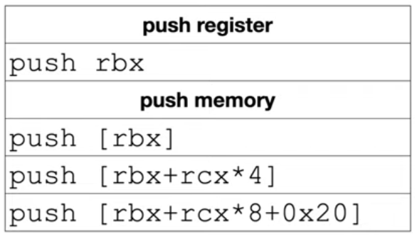

* **call/ret**  
`call` instruction manipulates both RSP & RIP to transfer control to a new location, while pushing the address of next instruction (i.e. one after the `call` instruction) onto the stack.     
`ret` manipulates both RSP & RIP by popping up an 8 byte value from top of the stack into RIP. 

```
ret             ; pop 8 bytes from stack into RIP
ret 0x20        ; along with pop, add 0x20 bytes to RSP
```

* **lea** (**L**oad **E**ffective **A**ddress)  
Uses r/mX form but is an exception to the *`treat the value in square-bracket as an address and dereference it [A]`* rule. It just simple **math evaluation**, i.e. just evaluate the expression inside `[expr]` and load/move it into destination operand. 
```
assuming: rbx=0x2 rdx=0x1000

lea rax, [rdx + rbx*8 + 5]      ; rax = 0x1015 (0x1000 + 0x10 + 0x5)
```

* **mov**  
Can move from reg->reg, reg->mem, imm->reg and vice versa but **`never from mem-mem`**. Source and Destination operands can mutually exclusively be given in `r/mX` memory addressing form. To cast a *C larger type* to *C smaller type*, we use `movsx` and `movzx`.       
If you want to move a smaller value, say `short int` (2 byte) into a larger variable, say `signed int` (4 bytes), visual studio compiler chooses `movsx` instruction (*move with sign extended value of short*) perserving the negative sign (if any) of `short int` value whereas if you wish to move an smaller value (say `short int`) into a larger variable, say `unsigned int`, then VS compiler chooses to use `movzx` (move with zero extended value of short) variant of mov instruction

```
short s = -10;          // bx   (16 bits)
unsigned int i;         // eax  (32 bits)
signed   int j;         // eax  (32 bits)


movzx   eax, bx     ; i = s (since unsigned value)
movsx   eax, bx     ; j = s (since signed value)
movsxd  rax, ecx    ; simply sign extend ecx to rax
```
`movsx` only deals with `8` & `16-bit` values. If you want to sign-extend 32-bit value to 64-bits, use `movsxd` (although there is NO movzxd).

* **add/sub**  
```
add rsp, 0x8        -> rsp = rsp + 0x8
sub rax, [rbx*2]    -> rax = rax - memoryPointedToBy(rbx*2)
```

* **imul**  
VScode prefers `imul` instead of vanilla `mul` to multiply 2 numbers. There are 3 forms of imul instruction.  

```
imul    r/mX                ; rdx:rax = rax  * r/mX
imul    reg, r/mX           ; reg     = reg  * r/mX
imul    reg, r/mX, imm      ; reg     = r/mx * imm 
```
Well, actually there are 13 forms which can be categorized in a group of 3.
```
imul Group1 - Single Operand
----------------------------
imul    r/m8                ; AX        = AL * r/m8
imul    r/m16               ; DX:AX     = AX * r/m16
imul    r/m32               ; EDX:EAX   = EAX * r/m32
imul    r/m64               ; RDX:RAX   = RAX * r/m64

imul Group2 - Two Operand (can cause truncation)
------------------------------------------------
imul    r16, r/m16          ; r16 = r16 * r/m16
imul    r32, r/m32          ; r32 = r32 * r/m32
imul    r64, r/m64          ; r64 = r64 * r/m64

imul Group3 - Three Operands (can cause truncation)
---------------------------------------------------
imul    r16, r/m16, imm8    ; r16 = r/m16 * sign-extended imm8 (upto 16 bits)
imul    r32, r/m32, imm8    ; r32 = r/m32 * sign-extended imm8 (upto 32 bits)
imul    r64, r/m64, imm8    ; r64 = r/m64 * sign-extended imm8 (upto 64 bits)

imul Group4 - Three Operands (16 bit immediate) (can cause truncation)
-----------------------------------------------------------------------
imul    r16, r/m16, imm16   ; r16 = r/m16 * imm16

imul Group5 - Three operands (32 bit immediate) (can cause truncation)
-----------------------------------------------------------------------
imul    r32, r/m32, imm32   ; r32 = r/m32 * imm32
imul    r64, r/m64, imm32   ; r64 = r/m64 * sign-extended imm32 (upto 64 bits)

```


## **Code Constructs**

### **Array Indexing**

```
int b[6];
b[3] = 0xdead;      // assuming rbx stores this value

mov     ecx, 0x4                    ; 0x4 is size of element
imul    ecx, ecx, 0x3               ; 0x3 is index
mov     dword ptr [rsp + rax], rbx   
```

### **Shadow Space**
* Microsoft compiler specifically implements a `calling convention` that not only passes the first 4 arguments through registers, but also reserves `**shadow store**` for them on the stack.
* The callee has the responsibility of dumping the register parameters (passed to it by the caller) into their **shadow space** if needed.
* Compiler reserves this space even if no function parameters are passed to another function (generally 0x20 bytes).  

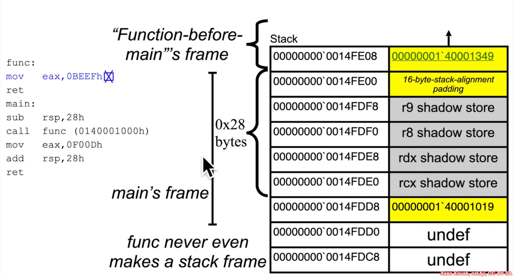

### **x64 Register Calling Conventions**
By default, **x64 microsoft ABI** uses `fast-call` calling convention (in contrast to `cdecl` & `stdcall` used in x86 arch). There are 2 elements in register calling conventions - 
```
* Volatile registers        (Caller-saved)
* Non-volatile registers    (Callee-saved)
```
* Microsoft ABI documentation for [x64 calling conventions] 
* For UNIX type platforms: [System V ABI] or [here] (AMD64) 

[x64 calling conventions]: https://docs.microsoft.com/en-us/cpp/build/x64-calling-convention?view=msvc-160
[System V ABI]:  https://raw.githubusercontent.com/wiki/hjl-tools/x86-psABI/x86-64-psABI-1.0.pdf
[here]: ./img/x86-64-psABI-1.0.pdf

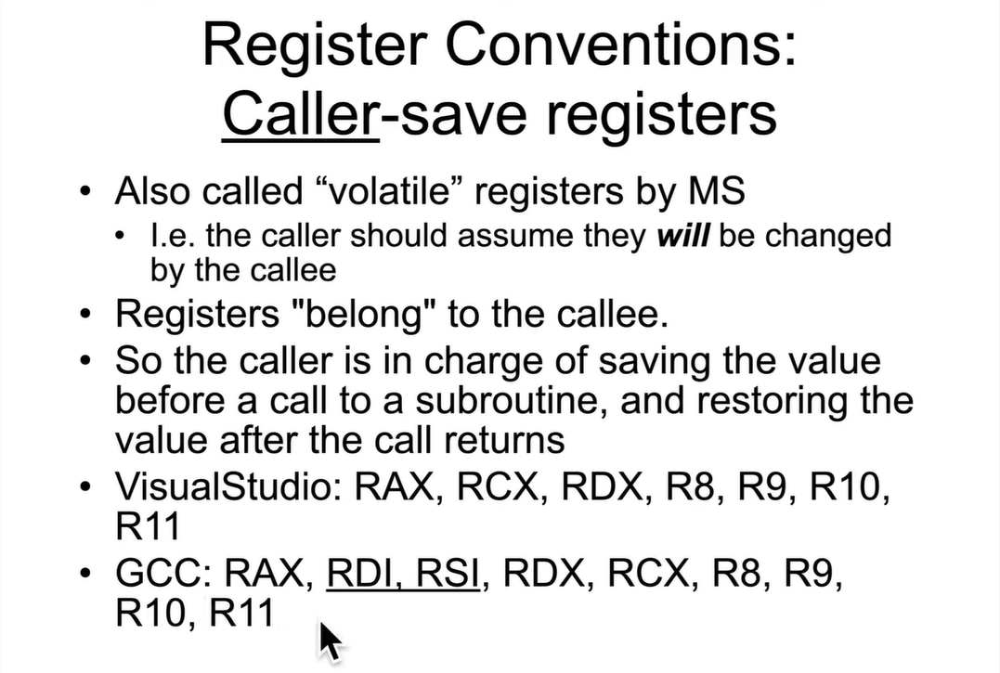
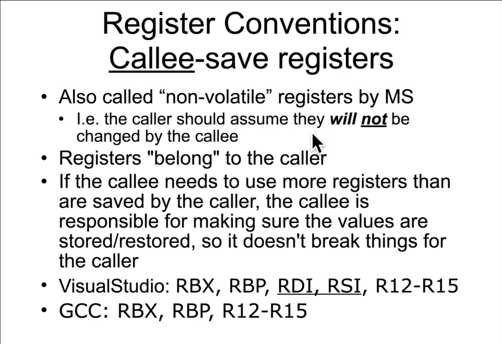
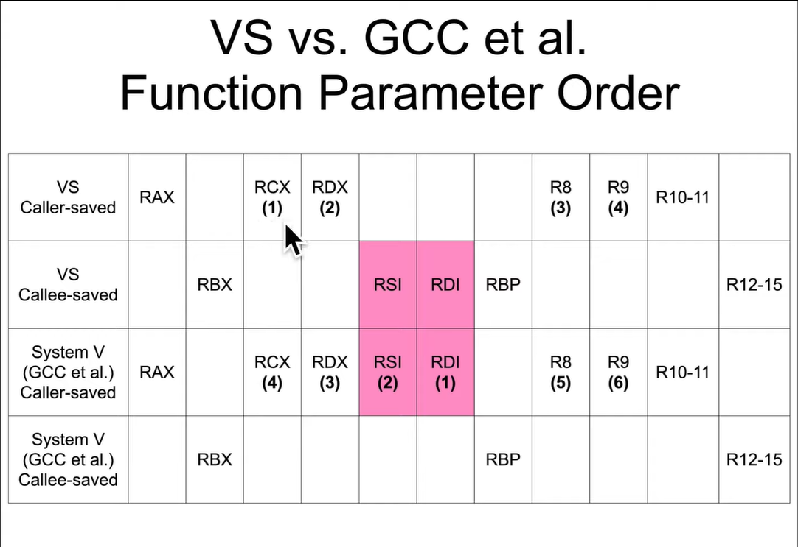
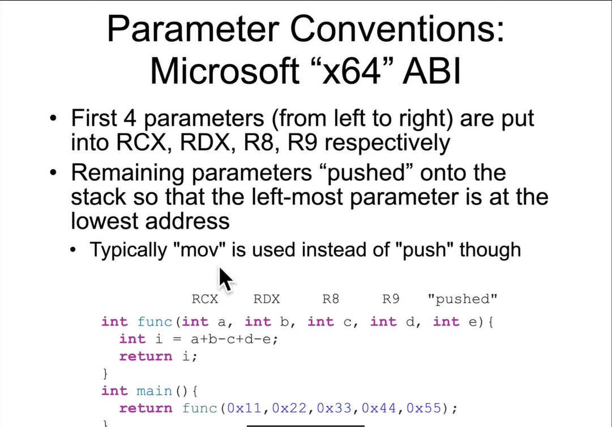
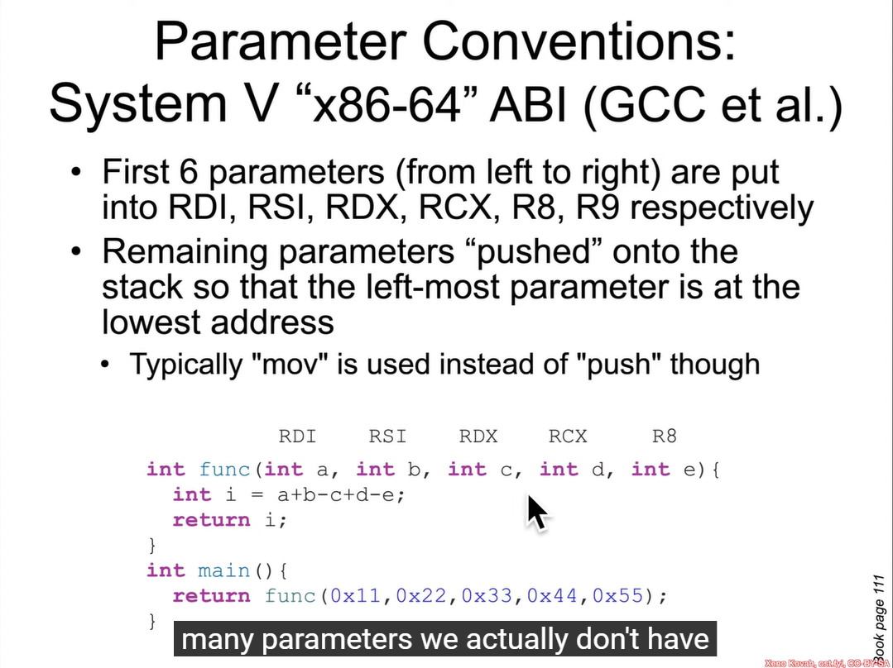
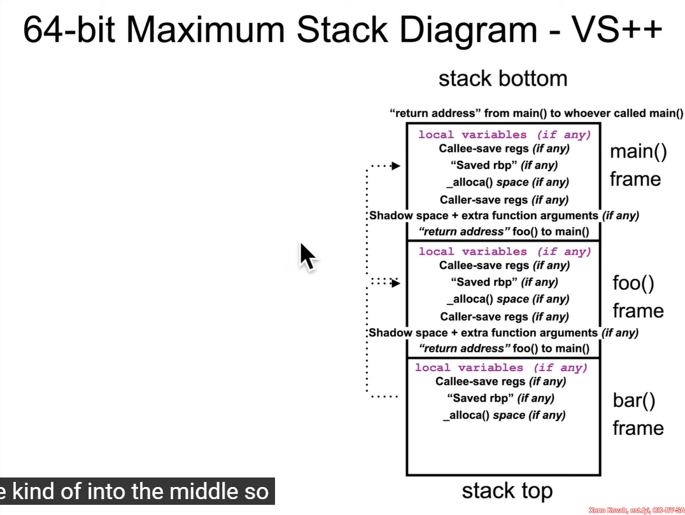
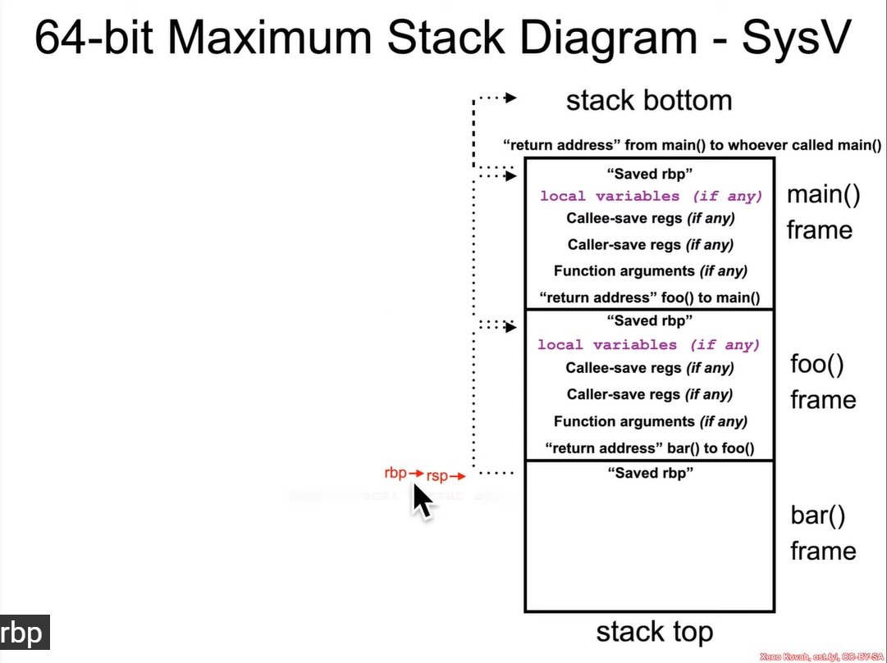


### **x86 Register Calling Conventions**
* In contrast to **x64 Intel**'s `fastcall` calling convention, the **x86 Intel** arch. used to `cdecl` (where the caller cleans up the stack ) & `stdcall` (`ret 0x20` example for callee to clean up the stack) calling conventions. **Function parameters** were pushed from right to left onto the stack.
* Microsoft documentation for [cdecl calling convention].
* Microsoft documentation for [stdcall calling convention].

[cdecl calling convention]: https://docs.microsoft.com/en-us/cpp/cpp/cdecl?view=msvc-160
[stdcall calling convention]: https://docs.microsoft.com/en-us/cpp/cpp/stdcall?view=msvc-160

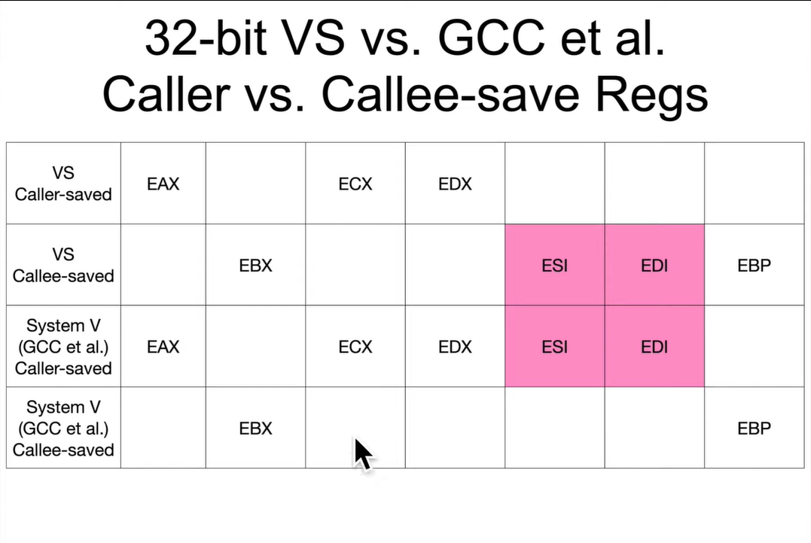
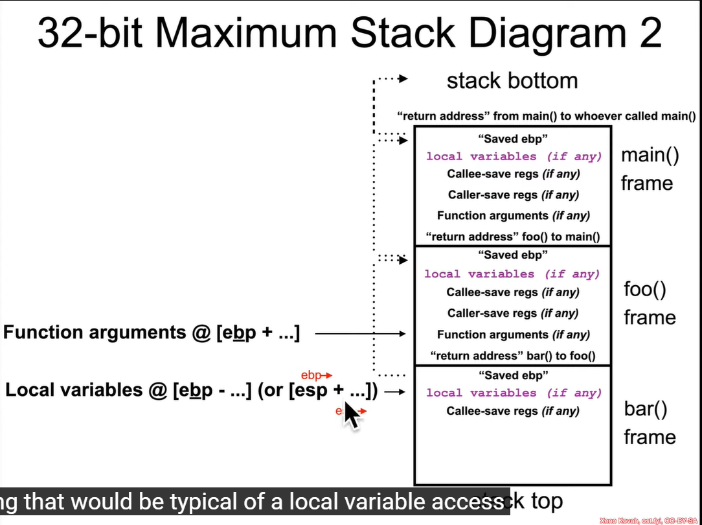