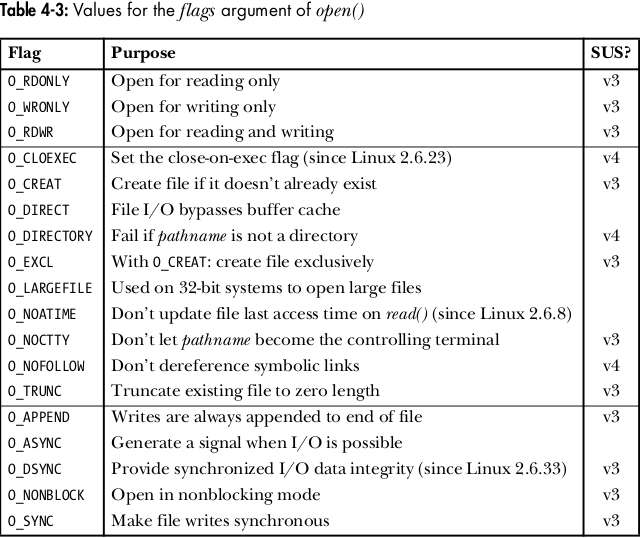

# CHEETSHEET
This contains my personal cheetsheet for syscalls encountered in **The Linux Programming Interface**.


## FILE I/O (Universal File I/O model)

```
#include <sys/stat.h>       /* for open/creat */
#include <fcntl.h>

#include <unistd.h>         /* for read/write/close/lseek */

#include <sys/ioctl.h>      /* for ioctl */
```

* int **`open`** (const char \*pathname, int flags, mode_t mode)  
~ *returns a file descriptor (success) or, -1 (failure).*
    
   
 

* int **`creat`** (const char *pathname, mode_t mode);  
~ equivalent to:  `fd = open(pathname, O_WRONLY | O_CREAT | O_TRUNC, mode);`
 
* ssize_t **`read`** (int fd, void *buffer, size_t count);  
~ returns number of bytes read, 0 on EOF or, -1 on error.

* ssize_t **`write`** (int fd, void *buffer, size_t count);  
~ returns number of bytes written, or -1 on error.

* int **`close`** (int fd);  
~ returns -1 on error.

* off_t **`lseek`** (int fd, off_t offset, int whence);  
~ For each open file, the kernel records a *file offset* (aka *read-write pointer*/*offset*) which is the location at which next read() or write() will begin (it is updated at each read() and write() syscall). lseek has the sole purpose of repositioning/adjusting the kernel's record of the *file offset* value associated with the open file descriptor (fd). It returns *new file offset* if successful, or -1 on error.
  
**NOTE** - lseek'ing and writing data past the EOF creates a **hole** in the file which can be programatically accessed but is *not allocated* any physical block space on disk. The file created is known as a **sparse file**.

* int **`fallocate`** (int fd, int mode, off_t offset, off_t len);  
~ A Linux specific syscall to allocate disk-space (in the form of disk blocks) for the hole (if any) in sparse files (files whose actual size is larger than on-disk space it consumes). After a successful call, any subsequent write to any hole byte in the file guaranteed not to fail because of lack of disk space (which may possibly happen when we try to write to a hole in any sparse file).

* int **posix_fallocate** (int fd, off_t offset, off_t len);  
~ A *glibc library function* which is a portable form of fallocate() syscall.

* int **`ioctl`** (int fd, int request, ... /* argp */);  
~ This syscall is used to perform all file & device operations that fall outside of the *universal I/O model (i.e. open/read/write/close since all file types & device drivers implement the same I/O interface allows for universality of I/O using these syscalls)*. Its return value depends on request, or -1 on error.

---